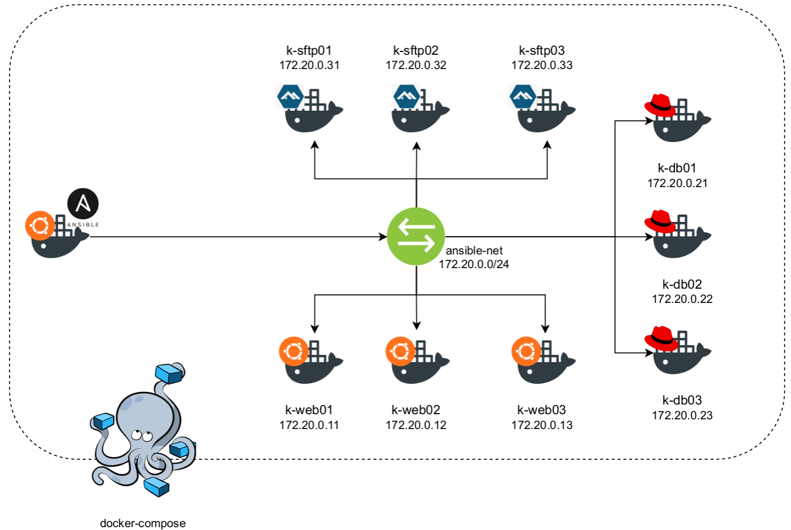

# Docker Ansbile Lab
#### _A Containerized Ansible Lab To Start Practicing Ansbile Right Away!_

    

## Contents
- [About the Project](#about-the-project)
- [Hosts](#hosts)
- [Requirements](#requirements)
- [Installing OpenSSH](#installing-openssh)
- [Installing Docker Engine](#installing-docker-engine)
- [Installing Docker-Compose](#installing-docker-compose)
- [Setting Up The Lab](#setting-up-the-lab)
- [Destroying The Lab](#destroying-the-lab)
- [Running Issues](#running-issues)

## About the Project
The aim of this project is to setup an Ansible Lab using Docker, the easy and fast to deploy container technology.
- Uses very less system resources
- Does not interfere with the system configurations
- Easy to deploy and can be removed very easily
- 1 Master Node & 9 Managed Nodes

## Hosts
- 3 Ubuntu 20.04 based webapp servers
- 3 RHEL 8 based database servers
- 3 Alpine 3.15 based SFTP servers



## Requirements
- Docker Engine Version: 20.10.12
- Docker-compose Version: 1.29.2
- OpenSSH

## Installing OpenSSH
OpenSSH can be installed and set to run at startups using the following command:

```sh
sudo apt-get install -y openssh-server openssh-client &&\
sudo systemctl enable ssh &&\
sudo systemctl restart ssh
```

## Installing Docker Engine
1. Update the apt package index and install packages to allow apt to use a repository over HTTPS:
```sh 
sudo apt-get update

sudo apt-get install \
    ca-certificates \
    curl \
    gnupg \
    lsb-release
```

2. Add Docker’s official GPG key:
```sh
 curl -fsSL https://download.docker.com/linux/ubuntu/gpg | sudo gpg --dearmor -o /usr/share/keyrings/docker-archive-keyring.gpg
```

3. Use the following command to set up the stable repository:
```sh
echo \
  "deb [arch=$(dpkg --print-architecture) signed-by=/usr/share/keyrings/docker-archive-keyring.gpg] https://download.docker.com/linux/ubuntu \
  $(lsb_release -cs) stable" | sudo tee /etc/apt/sources.list.d/docker.list > /dev/null

```
4. Update the apt package index, and install the latest version of Docker Engine and containerd:
```sh
sudo apt-get update
sudo apt-get install docker-ce docker-ce-cli containerd.io
```

5. Verify that Docker Engine is installed correctly by running the hello-world image. (OPTIONAL)
```sh
sudo docker run hello-world
```
_If the following output is shown, that means the installation is complete:_
```sh
Unable to find image 'hello-world:latest' locally
latest: Pulling from library/hello-world
2db29710123e: Pull complete 
Digest: sha256:975f4b14f326b05db86e16de00144f9c12257553bba9484fed41f9b6f2257800
Status: Downloaded newer image for hello-world:latest

Hello from Docker!
This message shows that your installation appears to be working correctly.

To generate this message, Docker took the following steps:
 1. The Docker client contacted the Docker daemon.
 2. The Docker daemon pulled the "hello-world" image from the Docker Hub.
    (amd64)
 3. The Docker daemon created a new container from that image which runs the
    executable that produces the output you are currently reading.
 4. The Docker daemon streamed that output to the Docker client, which sent it
    to your terminal.

To try something more ambitious, you can run an Ubuntu container with:
 $ docker run -it ubuntu bash

Share images, automate workflows, and more with a free Docker ID:
 https://hub.docker.com/

For more examples and ideas, visit:
 https://docs.docker.com/get-started/
```

## Installing Docker-Compose

1. Run this command to download the current stable release of Docker Compose:
```sh
sudo curl -L "https://github.com/docker/compose/releases/download/1.29.2/docker-compose-$(uname -s)-$(uname -m)" -o /usr/local/bin/docker-compose
```
2. Apply executable permissions to the binary:
```sh
sudo chmod +x /usr/local/bin/docker-compose
```
3. Test the installation:

```sh
sudo docker-compose --version
```
_If a similar output is shown, that means the installation is complete:_

```sh
docker-compose version 1.29.2, build 5becea4c
```

## Setting Up The Lab
The whole setup can be brought up with the following command:
```sh
sudo docker-compose -f docker-compose.yml --verbose up -d
```

The following command can be used to show the running docker containers: 
```sh
sudo docker ps -a
```

The expected output is similar to this:
```sh
CONTAINER ID   IMAGE           COMMAND               CREATED          STATUS          PORTS                                                    NAMES
a9ad4073a6f0   webubuntu2004   "/usr/sbin/sshd -D"   18 seconds ago   Up 16 seconds   22/tcp, 0.0.0.0:49225->1342/tcp, :::49225->1342/tcp      k-web03
f147bbed4b55   webubuntu2004   "/usr/sbin/sshd -D"   18 seconds ago   Up 16 seconds   22/tcp, 0.0.0.0:49221->1342/tcp, :::49221->1342/tcp      k-web01
2f1707788523   sftpalpine315   "/bin/sh"             18 seconds ago   Up 16 seconds   22/tcp, 0.0.0.0:49222->13342/tcp, :::49222->13342/tcp    k-sftp02
72eebc3cc8e6   sftpalpine315   "/bin/sh"             18 seconds ago   Up 16 seconds   22/tcp, 0.0.0.0:49224->13342/tcp, :::49224->13342/tcp    k-sftp03
f0dde3e7f29d   dbrhel8         "/bin/bash"           18 seconds ago   Up 16 seconds   222/tcp, 0.0.0.0:49223->13342/tcp, :::49223->13342/tcp   k-db01
c6dc979be60f   sftpalpine315   "/bin/sh"             18 seconds ago   Up 16 seconds   22/tcp, 0.0.0.0:49220->13342/tcp, :::49220->13342/tcp    k-sftp01
b662b8d2abd6   dbrhel8         "/bin/bash"           18 seconds ago   Up 17 seconds   222/tcp, 0.0.0.0:49219->13342/tcp, :::49219->13342/tcp   k-db03
ece40c6ec62f   webubuntu2004   "/usr/sbin/sshd -D"   18 seconds ago   Up 16 seconds   22/tcp, 0.0.0.0:49218->1342/tcp, :::49218->1342/tcp      k-web02
fa5bdd522b38   dbrhel8         "/bin/bash"           18 seconds ago   Up 17 seconds   222/tcp, 0.0.0.0:49217->13342/tcp, :::49217->13342/tcp   k-db02
49682919c5dc   masternode      "/usr/sbin/sshd -D"   18 seconds ago   Up 17 seconds   22/tcp, 0.0.0.0:49216->1342/tcp, :::49216->1342/tcp      k-master01
```


## Destroying The Lab
The whole setup can be brought down with the following command:
```sh
sudo docker-compose -f docker-compose.yml --verbose down -v
```

## Running Issues
- Cannot SSH into the RHEL8 based database servers
- Cannot SSH into the Alpine3.15 based SFTP servers
- The master node cannot access the managed nodes

